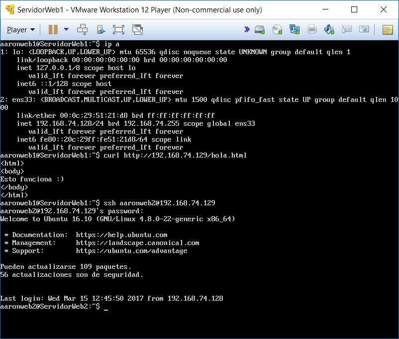
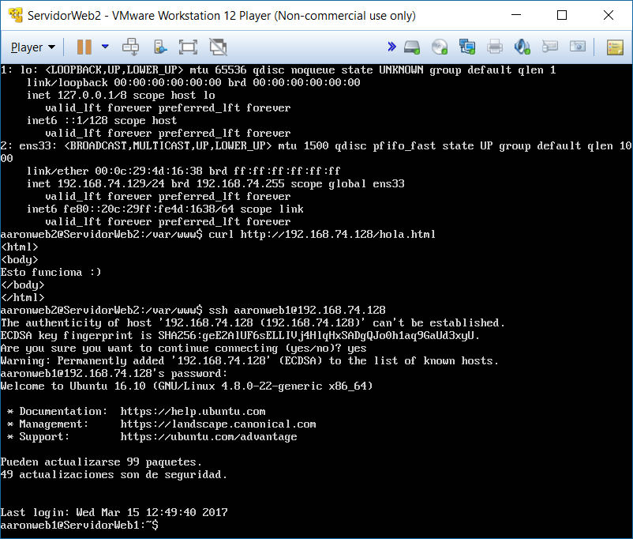

# Práctica de presentación y preparación de los materiales

Para comprobar que se ven entre los dos servers y que funcionan tanto el servicio LAMP y SSH de ambos, 
desde el servidor llamado "ServidorWeb1" he obtenido con cURL la página web del servidor "ServidorWeb2"
y he accedido por SSH, y lo mismo desde "ServidorWeb2" a "ServidorWeb1".

A continuación, muestro las pantallas de dichas acciones:

### Ubuntu Server 16.10 "ServidorWeb1"

### Ubuntu Server 16.10 "ServidorWeb2"

**IMPORTANTE:** no está configurada la IP estática, sigue por DHCP porque no conseguían comunicarse.