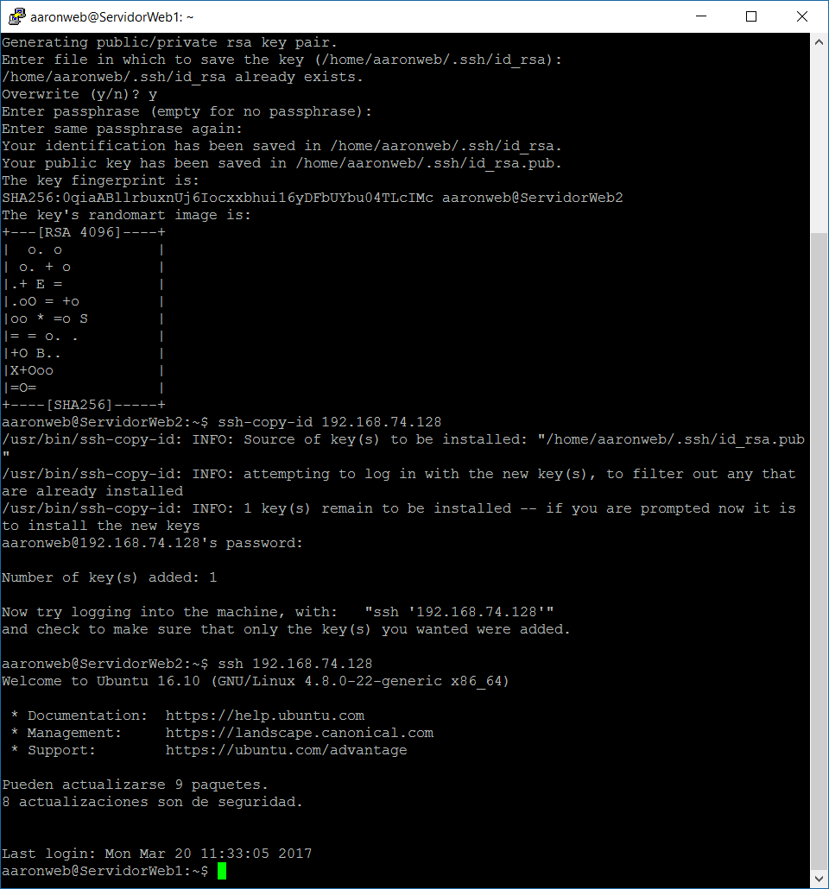
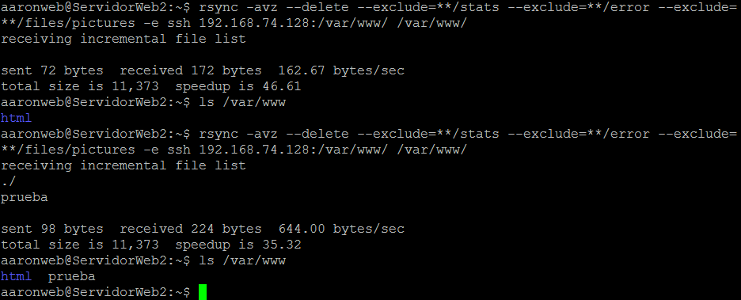
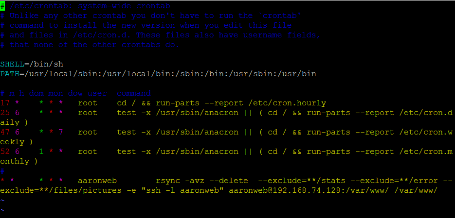
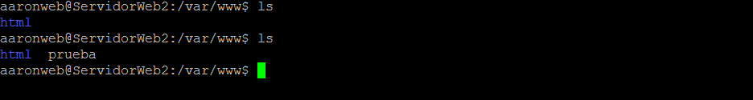

# Práctica 2: clonar la información de un sitio web

Lo primero que tuve que hacer (antes de empezar con la práctica) fue cambiar los nombres de los usuarios de los servers (tenía un nombre de usuario 
para cada servidor) al mismo, para seguir el consejo del profesor y evitarnos futuros quebraderos de cabeza. Para ello, desde root utilicé el comando
"usermod" para cambiarle el nombre tanto al usuario como a su directorio. También tuve que cambiarle el nombre al grupo de los usuarios con "groupmod".

Una vez todos tenían el mismo usuario, hice propietario al usuario de la carpeta "/var/www/" en ambos servidores.

Creé en el ServidorWeb1 un archivo llamado "prueba" en la carpeta "/var/www/", para posteriores pruebas:

Luego fui a instalar la herramienta rsync, pero creo recordar que ya estaba instalada. Comprobé con los comandos de rsync 
listados en el guión de la práctica desde la máquina 2, y efectivamente se copiaba dicho archivo.

Acto seguido, pasé a generar la clave en la máquina 2 (tipo rsa), la copié en la máquina 1, le cambié los permisos por si las moscas (eso en la máquina1) 
y probé a conectarme por ssh a ver si no me pedía la clave. Los pasos se pueden ver en la siguiente imagen:

Probé el comando final que iba a meter en el archivo "/etc/crontab/" para asegurarme de que funcionaba y que no me pedía contraseña:

Una vez cerciorado de que funciona, lo añadimos al archivo para que se sincronice cada minuto. El archivo queda de la siguiente manera:

Y ya por último miramos que se sincronice correctamente, mirando que el archivo "prueba" se copie a la máquina 2:

**P.D.:** la mayoría del informe se hizo a posteriori, ya que hasta la clase de prácticas no sabía que había que ir documentando los pasos, 
creo que está todo lo necesario, pero si hay algo que se me hubiera pasado fue por eso.