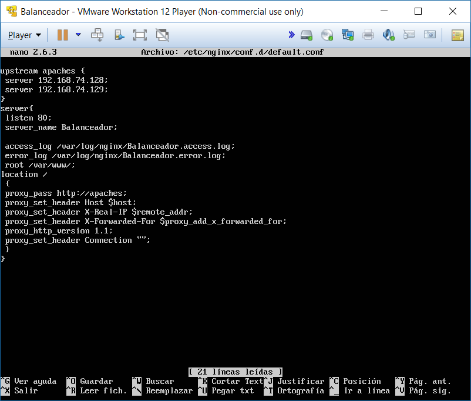
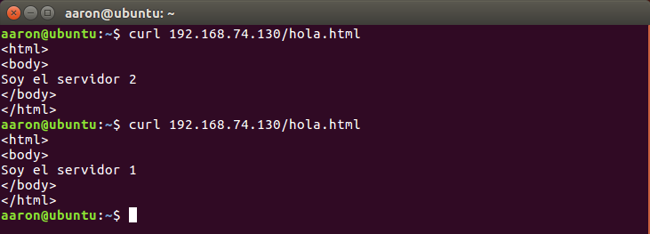
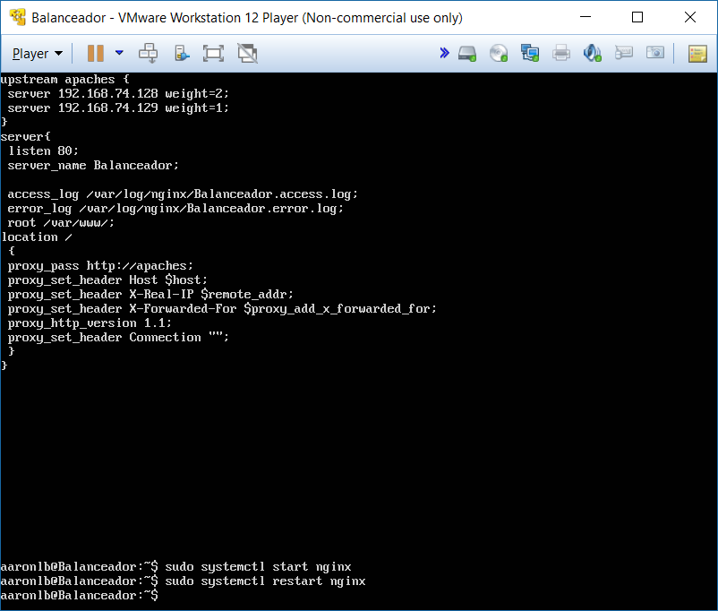
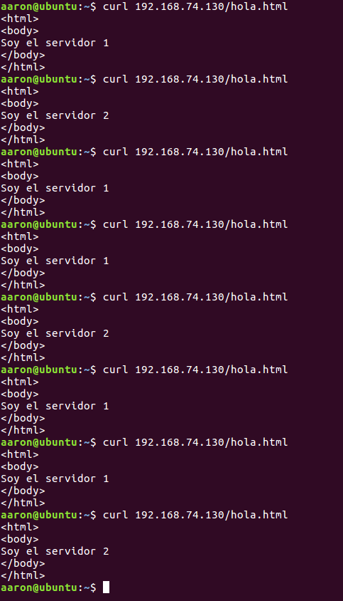
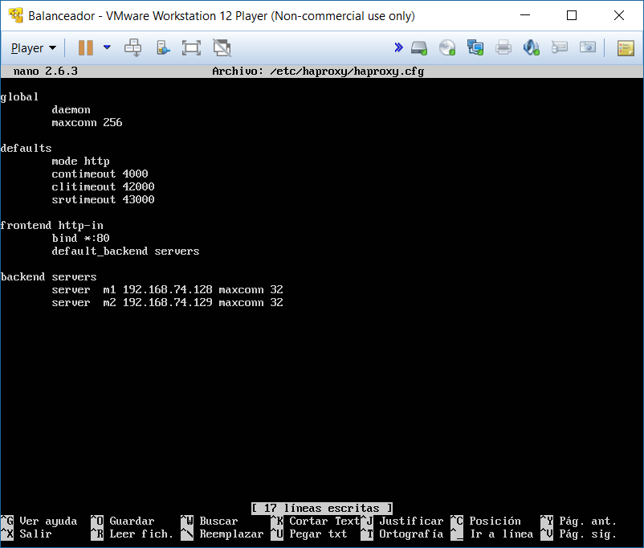
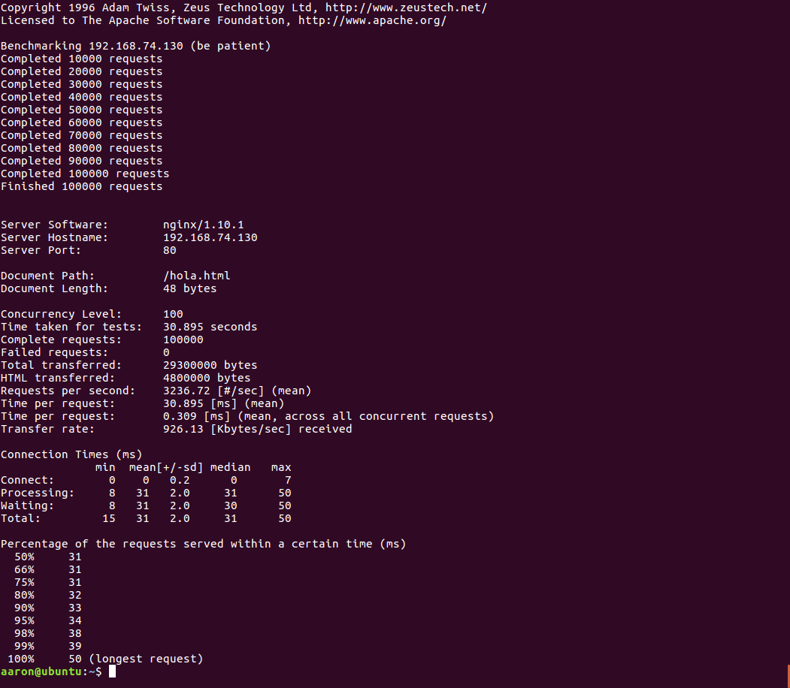
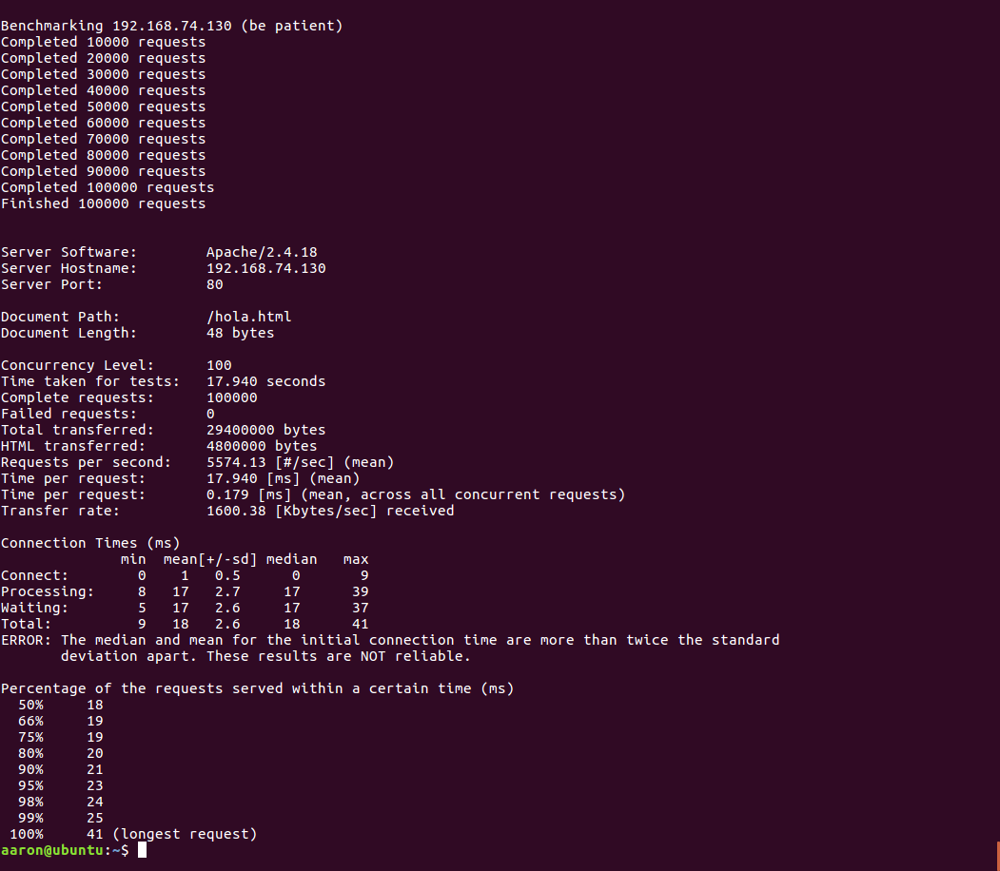

# Práctica 3: Balanceo de carga

Lo primero es crear una nueva máquina virtual para el balanceo de carga, sin instalar el servicio de Apache para quitarnos posteriores problemas de que pille el servicio http, necesario para el balanceador.

### El servidor web nginx

Lo instalamos con las árdenes dadas. Actualizamos el contenido del archivo /etc/nginx/conf.d/default.conf al que se nos indica en la práctica, pero aplicado a mi caso:

Sin embargo no funcionaba, pero al comentar la lánea: **include /etc/nginx/sites-enabled/***; del archivo */etc/nginx/nginx.conf* ya sá podrá acceder a las páginas de los otros dos servidores.

Para hacer la prueba de funcionalidad, tuve que comentar en el crontab del servidor2 la línea que sincronizaba cada minuto el contenido, y hacer que los dos servidores tengan páginas distintas. También aproveché e instalé un Ubuntu desktop para hacer las pruebas de forma externa a las tres máquinas actuales.

He aquí la prueba de que funciona correctamente el balanceador de carga:

Ahora probamos con otro algoritmo de elección, el de pesos. Para ello, le damos un peso de 2 al servidor 1 y un peso de 1 al servidor 2, de esta forma el servidor 1 debería tener el doble de peticiones que el 2. He aquí la prueba:

En cuanto a las diferentes opciones de configuración que se indican ( ip_hash, keepalive, ...), les he echado un vistazo, las he probado a aplicar y reiniciar el servicio y funciona, aunque el ver el cómo de algunas con las máquinas montadas no ha sido posible.

Como las máquinas tienen las mismas prestaciones, dejo Round-Robin activo finalmente.

### El servidor web haproxy

Instalamos el servicio y configuramos el archivo **/etc/haproxy/haproxy.cfg** como indica el guión:

Paramos el servicio de nginx, echamos a andar el de haproxy (si no hemos parado antes el nginx nos saldrá un ALERT diciendo que no puede apropiarse del puerto, por lo que no se activa) y comprobamos que el servicio está funcionando correctamente:

### Someter a una alta carga el servidor balanceado

Lo primero es instalar en una máquina externa la herramienta Apache Benchmark. Utilizaré el Ubuntu desktop instalado anteriormente. El comando para instalarlo usado ha sido el siguiente: *apt-get install apache2-utils*

Ahora ponemos en marcha la herramienta. Probamos la potencia del nginx:

Y ahora el haproxy:

Las pruebas se han hecho para 100000 peticiones, pedidas concurrentemente de 100 en 100, números más que suficientes para resentir al servidor. Como se puede comprobar por las imágenes, el balanceador que da mejores prestaciones en mi caso es el haproxy. Esto se puede ver en que aunque los dos no han fallado en ninguna petición, haproxy tiene una tasa de peticiones contestadas por segundo más de un 50% más alto que nginx.

De hecho, aunque no tengo puesta ninguna captura para nginx, hice pruebas de pedir concurrentemente de 500 en 500 100000 peticiones, y mientras el haproxy conseguía pasar el benchmark aunque con 109 errores, con nginx salía un error de "conection reset by peer".

