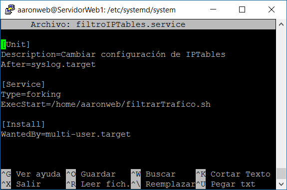

# Práctica 4: Asegurar la granja web

### Certificado SSL autofirmado

Entrando como root, activamos el módulo SSL de Apache y generamos el certificado:

~~~
a2enmod ssl
service apache2 restart
mkdir /etc/apache2/ssl
openssl req -x509 -nodes -days 365 -newkey rsa:2048 -keyout /etc/apache2/ssl/apache.key -out /etc/apache2/ssl/apache.crt
~~~

Metemos los mismos datos que aparecen en la imagen del guión. Luego cambiamos la configuración para especificarle la ruta de los mismos del archivo /etc/apache2/sites-available/default-ssl:

~~~
SSLCertificateFile /etc/apache2/ssl/apache.crt
SSLCertificateKeyFile /etc/apache2/ssl/apache.key
~~~

Comprobamos su correcto funcionamiento desde la máquina física, accediendo por el protocolo HTTPS a la máquina 1:

### Configuración de IPTables

Como indicó el profesor, la configuración de IPTables se hará sobre la máquina 1 como parte obligatoria. Después de probar varios comandos de IPTables para familiarizarnos, creamos un script (recordar darle permisos de ejecución), primero para restaurar la configuración de IPTables en caso de que cuando la tocáramos no funcionara como se espera (el mismo que nos indican en el guión). También nos muestra automáticamente el estado de la configuración de IPTables, para comprobar que ha vuelto a su estado original:

~~~
# (1) Eliminar todas las reglas (configuración limpia)
iptables -F
iptables -X
iptables -Z
iptables -t nat -F

# política por defecto: aceptar todo
iptables −P INPUT ACCEPT
iptables −P OUTPUT ACCEPT
iptables −P FORWARD ACCEPT

iptables -L -n -v
~~~

Ahora creamos el de la configuración que deseamos que se ejecute siempre (también copiado del guión):

~~~
# (1) Eliminar todas las reglas (configuración limpia)
iptables -F
iptables -X
iptables -Z
iptables -t nat -F

# (2) Política por defecto: denegar todo el tráfico
iptables -P INPUT DROP
iptables -P OUTPUT DROP
iptables -P FORWARD DROP

# (3) Permitir cualquier acceso desde localhost (interface lo)
iptables -A INPUT -i lo -j ACCEPT
iptables -A OUTPUT -o lo -j ACCEPT

# (4) Abrir el puerto 22 para permitir el acceso por SSH
iptables -A INPUT -p tcp --dport 22 -j ACCEPT
iptables -A OUTPUT -p tcp --sport 22 -j ACCEPT

# (5) Abrir los puertos HTTP (80) de servidor web
iptables -A INPUT -p tcp --dport 80 -j ACCEPT
iptables -A OUTPUT -p tcp --sport 80 -j ACCEPT
~~~

Como mi sistema usa systemd, lo configuramos para que se ejecute el script al iniciar la máquina. Para ello, nos vamos a la carpeta /etc/systemd/system y creamos un script, que será el que se ejecute cuando se inicie el sistema, y llamará a nuestro script de configuración de IPTables:

Le cambiamos los permisos a -rwxr-xr-x. Relogueamos systemd para que vea los servicios:

~~~
systemctl daemon-reload
~~~

Levantamos el nuevo script:

~~~
systemctl start filtroIPTables.service 
~~~

Comprobamos que el servicio funciona correctamente:

Las primeras líneas son de pruebas con error, pero se ve que en las últimas líneas del log el servicio funcionaba correctamente.

Por último, habilitamos el servicio para el autoarranque:

~~~
systemctl enable filtroIPTables.service
~~~

Comprobamos que el servicio se inicia correctamente al reiniciar el sistema: 

Me encuentro con que se me había olvidado abrir el puerto de HTTPS (443), así que obviamente no he podido acceder a la página web. Lo incluimos en nuestro script:

~~~
# (6) Abrir los puertos HTTPS (443) de servidor web
iptables -A INPUT -p tcp --dport 443 -j ACCEPT
iptables -A OUTPUT -p tcp --sport 443 -j ACCEPT
~~~

Reiniciamos el servicio. Ahora sí, se puede acceder a la página web del servidor mediante protocolo HTTPS:

