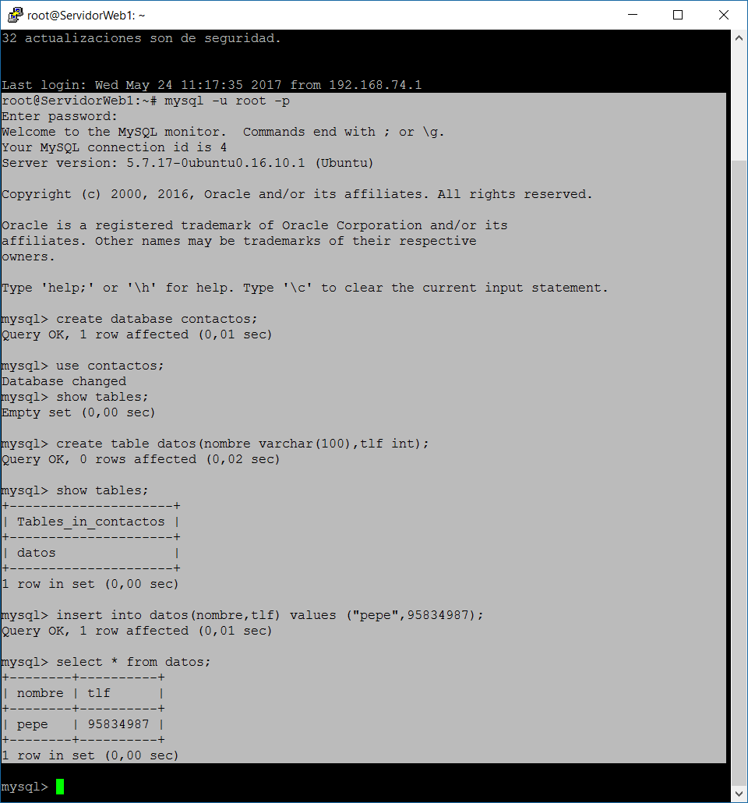
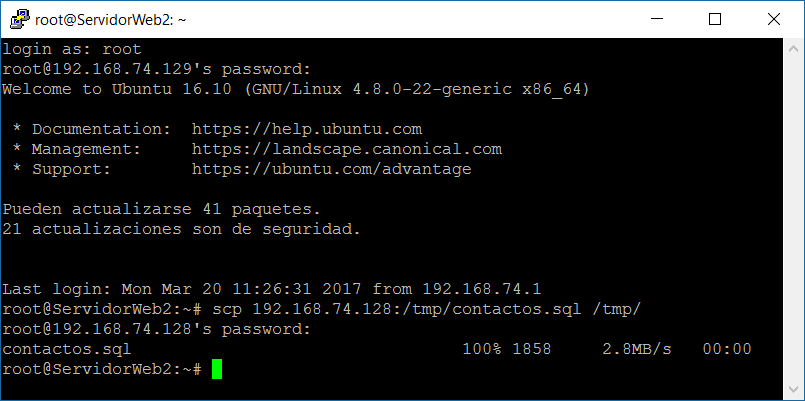
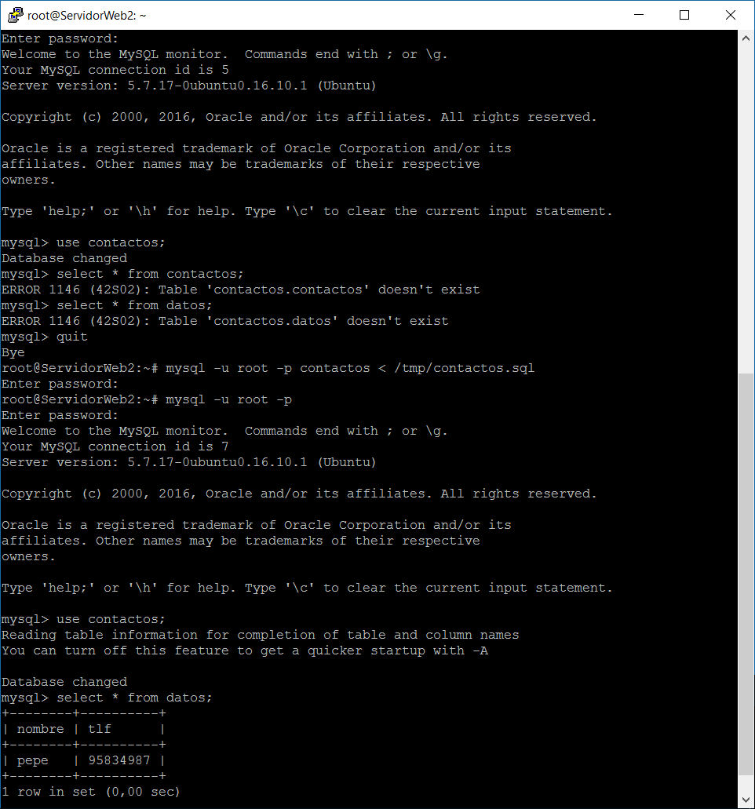
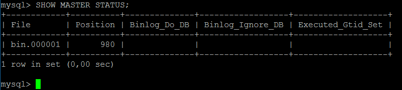
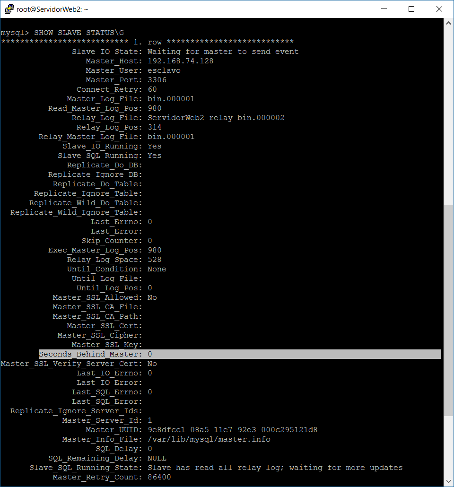
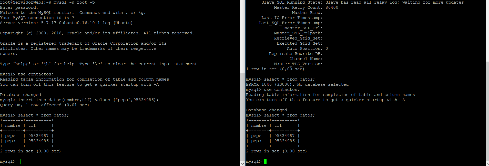

# Práctica 5: Replicación de bases de datos MySQL

### Creación de una base de datos MySQL e inserción de datos 

Creamos una base de datos en modo comando y le introducimos algunos datos:

### Replicación de la base de datos con mysqldump

Primero debemos bloquear la base de datos para que no se modifique en el tránsito de clonación:

~~~
mysql -u root –p

mysql> FLUSH TABLES WITH READ LOCK;
mysql> quit
~~~

Ahora copiamos la base de datos "contactos" en la misma máquina en la que estamos (la máquina 1):

~~~
mysqldump contactos -u root -p > /tmp/contactos.sql
~~~

Importante desbloquear la base de datos una vez se haya hecho la copia:

~~~
mysql -u root –p

mysql> UNLOCK TABLES;
mysql> quit
~~~

Ahora vamos a la máquina 2 y copiamos el archivo .sql con el comando scp:

Como esta copia no crea la base de datos, solo actualiza los datos en ella, hay que crearla manualmente primero:

~~~
mysql -u root –p

mysql> CREATE DATABASE contactos;
mysql> quit
~~~

Ahora la actualizamos con el contenido de la base de datos de la máquina 1:

Aquí se puede comprobar que la actualización de los datos de la base de datos "contactos" ha sido efectuada correctamente.

### Replicación de la base de datos mediante una configuración maestro-esclavo

Primero comprobamos la versión de nuestro mysql con el comando:

~~~
mysql --version
~~~

En mi caso tengo en las dos máquinas la versión 5.7.17. Como estamos en una versión **superior o igual a la 5.5** , **no tenemos que indicar los datos relativos al master en el archivo de configuración del esclavo**.

Primero configuramos el mysql de la máquina maestra, en nuestro caso la 1. Para ello editamos el archivo /etc/mysql/mysql.conf.d/mysqld.cnf, y hacemos las siguientes indicaciones:

- Comentamos el parámetro de que escuche a un servidor:

~~~
#bind-address 127.0.0.1
~~~

- Le indicamos el archivo donde almacenar el log de errores (para el rastreo de errores si los hubiera en un futuro):

~~~
log_error = /var/log/mysql/error.log
~~~

En mi caso, este parámetro ya estaba puesto.

- Le asignamos un ID de servidor:

~~~
server-id = 1
~~~

Sólo tuve que descomentarlo.

- Ahora para el registro binario:

~~~
log_bin = /var/log/mysql/bin.log
~~~

Estaba comentado y con otra ruta. Simplemente lo descomenté y le cambié la ruta a ésta.

Guardamos y reiniciamos mysql:

~~~
/etc/init.d/mysql restart
~~~

Si no ha dado error, la configuración del maestro ha tenido éxito. Ahora pasamos al esclavo (máquina 2). La diferencia con la configuración del maestro es que en el esclavo el server-id es en este caso 2. Recordar reiniciar el servicio una vez se configure el archivo y comprobar que no hay ningún fallo.

Vamos al maestro y le damos permisos de acceso. Para ello, creamos un usuario para el esclavo, y le damos permiso de replicación a éste:

~~~
mysql -u root -p

mysql> CREATE USER esclavo IDENTIFIED BY 'esclavo';

mysql> GRANT REPLICATION SLAVE ON *.* TO 'esclavo'@'%' IDENTIFIED BY 'esclavo';

mysql> FLUSH PRIVILEGES;

mysql> FLUSH TABLES;

mysql> FLUSH TABLES WITH READ LOCK;
~~~

Hay que sacar ciertos datos para usarlos en la configuración del esclavo. Para ello, usamos el siguiente comando:

Volvemos al esclavo y metemos los datos desde el entorno de mysql (por ser una versión superior a la 5.5, si no, hay que irse de nuevo al archivo de configuración):

~~~
mysql -u root -p

mysql> CHANGE MASTER TO MASTER_HOST='192.168.74.128', MASTER_USER='esclavo', MASTER_PASSWORD='esclavo', MASTER_LOG_FILE='bin.000001', MASTER_LOG_POS=980, MASTER_PORT=3306;
~~~

Ahora sólo queda arrancar el esclavo:

~~~
mysql> START SLAVE;
~~~

Desbloqueamos las tablas que teníamos bloqueadas en el maestro:

~~~
mysql> UNLOCK TABLES;
~~~

Para comprobar que la configuración maestro-esclavo ha sido un éxito, usamos en el esclavo la siguiente orden:

Si el contenido de la variable "Seconds_Behind_Master" es distinto de null, significa que todo funciona correctamente. 

Por último, se puede introducir un dato en el maestro para comprobar si aparece en el esclavo:

