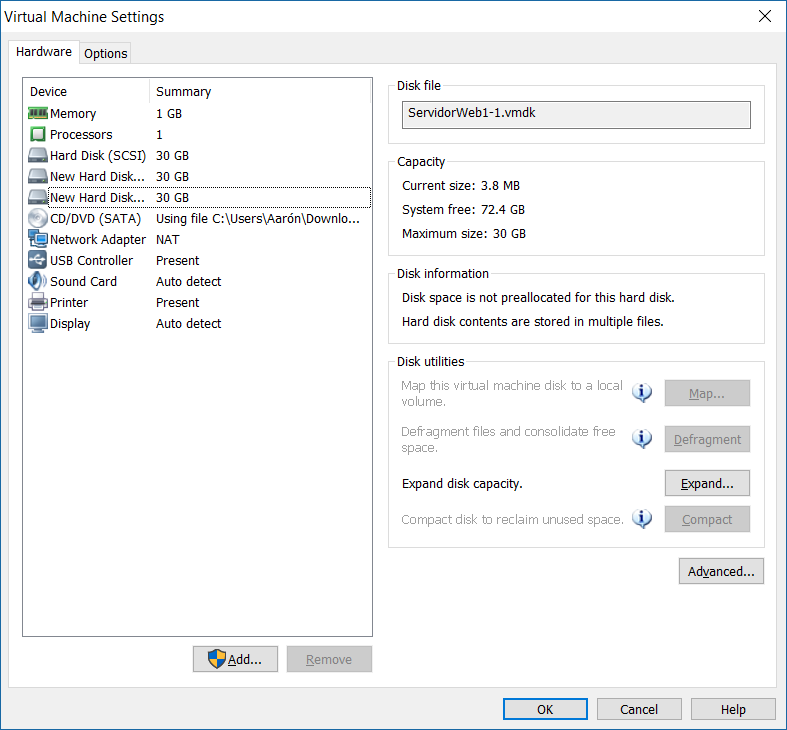
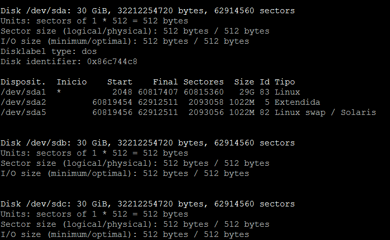
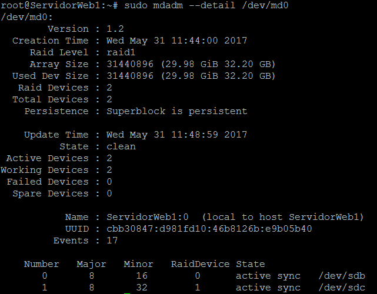
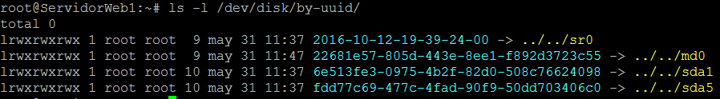
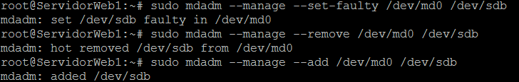

# Práctica 6: Discos en RAID

### Configuración del RAID por software

Para esta práctica, usaremos la máquina 1. Le añadimos dos discos del mismo tipo y capacidad que el que tiene actualmente **mientras está apagada**:

Ahora instalamos el software que vamos a usar para configurar el RAID (en nuestro caso, la librería *mdadm*):

~~~
sudo apt-get install mdadm
~~~

Buscamos la información de los discos (el nombre que le ha dado Linux a los nuevos discos):

~~~
sudo fdisk -l
~~~

Ahora creamos el RAID 1 con el siguiente comando:

~~~
sudo mdadm -C /dev/md0 --level=raid1 --raid-devices=2 /dev/sdb /dev/sdc
~~~

El RAID 1 vendría a ser el nuevo dispositivo /dev/md0. Sin embargo, cuando reiniciemos el sistema, Linux lo renombrará como /dev/md127 **(no reiniciar todavía el sistema)**.

Le damos formato al nuevo dispositivo:

~~~
sudo mkfs /dev/md0
~~~

Ahora montamos el dispositivo en un directorio:

~~~
sudo mkdir /dat
sudo mount /dev/md0 /dat
~~~

Para comprobar si se ha hecho correctamente, usamos:

~~~
sudo mount
~~~

Comprobamos el estado del RAID:

Por último, tenemos que configurar el sistema para que monte el dispositivo RAID cada vez que se inicie el sistema.

Primero vamos a obtener el UUID utilizamos el siguiente comando:

Ahora nos vamos al archivo /etc/fstab y lo añadimos:

~~~
UUID=22681e57-805d-443e-8ee1-f892d3723c55 /dat ext2 defaults 0 0
~~~

Ya tenemos nuestro dispositivo RAID montado.

Ahora si queremos hacer comprobaciones de que funciona correctamente, podemos probar a simular un fallo en un disco:

~~~
sudo mdadm --manage --set-faulty /dev/md0 /dev/sdb
~~~

Retiramos en caliente el disco que falla:

~~~
sudo mdadm --manage --remove /dev/md0 /dev/sdb
~~~

Y añadimos en caliente un nuevo disco para reemplazar el anterior:

~~~
sudo mdadm --manage --add /dev/md0 /dev/sdb
~~~

